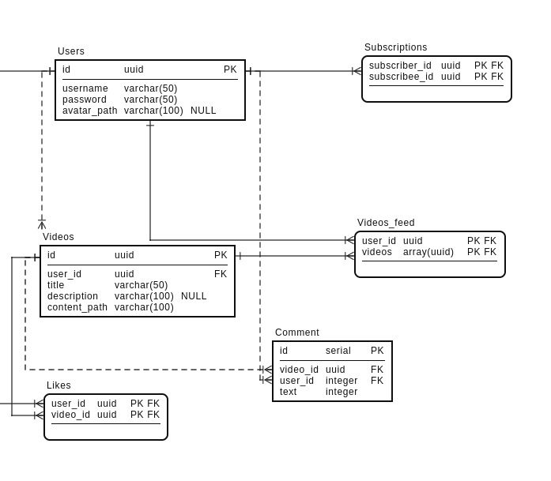

# highload

###1. Тема

Сегмент: Россия
Количество пользователей в России - 25 млн человек.
Количество активных пользователей в России - 15 млн человек.
Средний возраст пользователей от 15 до 25 лет.
Среднее время просмотра в день - 40 минут.

###2. Расчет нагрузки

Среднее количество открытий приложения в день: 7
Максимальная длина ролика: 1 минута
Минимальная длина ролика: 15 секунд
Средняя длина ролика: 30 секунд

Источники:
https://news.cpa.ru/tiktok-showed-audience-statistics/
https://tiktokit.ru/razreshenie-video-dlya-tik-tok/

За 2 минут использования сервиса было загружено ресурсов на 49.7 мб.

Запросы за видео контентом потребляют 38.6 мб.
Запросы за статикой потребляют 4.2 мб.
Остальные запросы можно отнести к бизнес-логике, они потребляют 6.9 мб

За время использования сервиса было сделано 222 запроса, из них:

57 запросов за видео контентом.
89 запросов за статикой.
76 запросов за бизнес-логикой.

Теперь можно подсчитать нагрузку на одного пользователя в секунду.

На одного пользователя потребуется (49.7 * 8) / (2 * 60) = 3.3 мбит / с

Нагрузка пользователя в секунду | Сеть | Запросы
--- | --- | ---
Видео контент | (38.6 * 8) / (2 * 60) = **2.57** мбит / с | 57 / (2 * 60) = **0.475** rps
Статика | (4.2 * 8) / (2 * 60) = **0,28** мбит / с | 89 / (2 * 60) = **0.74** rps
Бизнес-логика | (6.9 * 8) / (2 * 60) = **0.46** мбит / с | 76 / (2 * 60) = **0.63** rps

Так как длительность использования сервиса в день - 40 минут, то подсчитаем нагрузку от одного пользователя в день:

Нагрузка пользователя в день | Сеть | Запросы
--- | --- | ---
Видео контент | 2.57 * 60 * 40 = **6168** мбит / с | 0.475 * 60 * 40 = **1140** rps
Статика | 0,28 * 60 * 40 = **672** мбит / с | 0.74 * 60 * 40 = **1776** rps
Бизнес-логика | 0.46 * 60 * 40 = **1104** мбит / с | 0.63 * 60 * 40 = **1512** rps

Дневную нагрузку рассчитаем как 40% от активных пользователей, 15 000 000 * 0,4 = 6 000 000 пользователей

Нагрузка дневной аудитории | Сеть | Запросы
--- | --- | ---
Видео контент | (6168 * 6 000 000) / (24 * 60 * 60)  = **0.41** тбит / с | (1140 * 6 000 000) / (24 * 60 * 60) = **79 166** rps
Статика | (672 * 6 000 000) / (24 * 60 * 60) = **45.5** гбит / с | (1776 * 6 000 000) / (24 * 60 * 60) = **123 333** rps
Бизнес-логика | (1104 * 6 000 000) / (24 * 60 * 60) = **75** гбит / с | (1512 * 6 000 000) / (24 * 60 * 60) = **105 000** rps

###3. Логическая схема БД

###4. Физическая схема БД
###5. Выбор технологий
###6. Схема проекта

