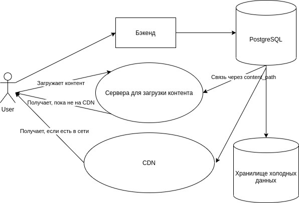
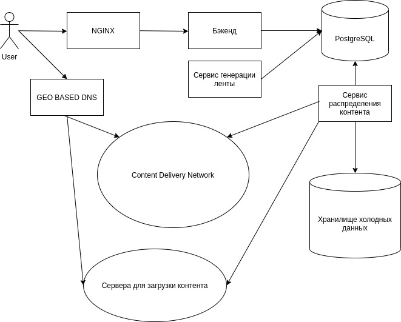

# highload

### 1. Тема

Сегмент: Россия Количество пользователей в России - 25 млн человек. Количество активных пользователей в России - 15 млн
человек. Средний возраст пользователей от 15 до 25 лет. Среднее время просмотра в день - 40 минут.

### 2. Расчет нагрузки

Среднее количество открытий приложения в день: 7 Максимальная длина ролика: 1 минута Минимальная длина ролика: 15 секунд
Средняя длина ролика: 30 секунд

Источники:
[1](https://news.cpa.ru/tiktok-showed-audience-statistics/)
[2](https://tiktokit.ru/razreshenie-video-dlya-tik-tok/)
[3](https://tiktok-wiki.com/statistika-tik-tok.html/)

Так как активная аудитория составляет 15 000 000 человек, то для активной дневной аудитории будем использовать аудиторию, равную 40% от активных пользователей, 15 000 000 * 0,4 = 6 000 000 пользователей
Так как длительность использования сервиса в день - 40 минут, то подсчитаем нагрузку от одного пользователя:
#### Запросы

За время использования сервиса было сделано 222 запроса, из них:

57 запросов за видео контентом. 
89 запросов за статикой. 
76 запросов за бизнес-логикой.

Можно подсчитать среднее количество запросов в секунду:

```
(57 + 89 + 76) / (2 * 60) * 6 000 000 / (24 * 60 * 60) = 128.4 rps
```

При одновременном использовании сервисом половины от дневной аудитории нагрузка будет составлять:
```
(57 + 89 + 76) / (2 * 60) * 3 000 000 / (40 * 60) = 2312.5 rps
```

За 2 минут использования сервиса было загружено ресурсов на 49.7 мб.

Запросы за видео контентом потребляют 38.6 мб. Запросы за статикой потребляют 4.2 мб. Остальные запросы можно отнести к
бизнес-логике, они потребляют 6.9 мб

Теперь можно подсчитать нагрузку на одного пользователя в секунду.

На одного пользователя потребуется (49.7 * 8) / (2 * 60) = 3.3 мбит / с

Нагрузка пользователя в секунду | Сеть 
--- | ---
Видео контент | (38.6 * 8) / (2 * 60) = **2.57** мбит / с 
Статика | (4.2 * 8) / (2 * 60) = **0,28** мбит / с 
Бизнес-логика | (6.9 * 8) / (2 * 60) = **0.46** мбит / с

Нагрузка пользователя в день | Сеть 
--- | --- 
Видео контент | 2.57 * 60 * 40 = **6168** мбит
Статика | 0,28 * 60 * 40 = **672** мбит
Бизнес-логика | 0.46 * 60 * 40 = **1104** мбит

Нагрузка дневной аудитории | Сеть 
--- | ---
Видео контент | (6168 * 6 000 000) / (24 * 60 * 60)  = **0.41** гбит
Статика | (672 * 6 000 000) / (24 * 60 * 60) = **45.5** гбит
Бизнес-логика | (1104 * 6 000 000) / (24 * 60 * 60) = **75** гбит 

#### Объёмы видео

Согласно источнику: [1](https://news.cpa.ru/tiktok-showed-audience-statistics/)
Пользователи загружают 20 000 000 видео в месяц. 73% используют Android-устройства, а 27% – посещают сервис с iOS.
Согласно другому источнику: [2](https://tiktokit.ru/razreshenie-video-dlya-tik-tok/) максимальный размер видео для
платформы Android 75 мб, для IOS составляет 250 мб. Можем посчитать максимальный средний вес одного видео - 0.73 * 75 +
0.27 * 250 = **122.25** мб. Так как максимальная длина видео равна 60 секундам, то мы можем подсчитать битрейт видео.
Битрейт - 122.25 * 8 / 60 = 16.3 мбит / с. Так как средняя длина видео равна 30 секундам, то средний объём одного видео
равен 30 * 16.3 / 8 = 61 мб.

При 20 000 000 загрузок видео в месяц, объём необходимого хранилища на месяц равен 20 000 000 * 61 = **1163** тб

### 3. Логическая схема БД


### 4. Физическая схема БД

В качестве СУБД будет использоваться PostgreSQL, из-за своей производительности, распространённости и функциональности, также удобно использовать array типы для хранения данных для ленты видео.
Так как основная нагрузка идёт не на бэкенды и не на базу данных, то смысла шардировать БД смысла нет. Для обеспечения устойчивости следует для master БД следует создать 2 slave'а, которые будут использоваться только для чтения.

Расчёт примерного размера БД:

```
Размер uuid – 16 байт

Users:

id (16) + username(50) + password(50) + avatar_path(100) = 216 bytes per user
216 * 25 000 000 ~ 5 гб

Subscriptions:

subscriber_id(16) + subscribee_id(16) = 32 bytes per subscription

Пусть одному пользователю будет соответствовать 10 подписок

32 * 10 * 25 000 000 ~ 7,45 гб

Videos:

id(16) + user_id(16) + title(50) + description(100) + content_path(100) + sound_id (16) = 298 bytes per video

Количество загружаемых видео соответствует 20 млн в месяц, на первый год потребуется 12 * 20 000 000 * 298 ~ 66,6 гб

Videos_feed:

user_id(16) + videos(80 * 16) = 1296 per user

Расчёт количества видео, хранимых для ленты, исходит из среднего времени сеанса пользователя – 40 минут и средней длины видео - 30 секунд.

1296 * 25 000 000 ~ 30 гб

Likes:

user_id (16) + video_id(16) = 32 bytes per like

В соответствии с источником в месяц пользователи ставят лайк 1,62 млрд раз. На первый год потребуется 32 * 12 * 1 620 000 000 ~ 580 гб

Источник: https://news.cpa.ru/tiktok-showed-audience-statistics/

Comments:

user_id (16) + video_id(16) + text (300) = 332 bytes per comment

Так как статистика по количеству комментариев не доступна, то будет считать, что пользователь оставляет 1 комментарий раз в 3 дня.

Таким образом на первый год потребуется 25 000 000 * (365 / 3) * 332 ~ 940 гб
```

#### Cхема физической связи:



Основная нагрузка идёт на видео трафик, поэтому для стабильного функционирования следует спроектировать CDN для доставки контента пользователям.
Контент для хранения следует разделять на "горячий" и "холодный", так как лента для пользователя создаётся с помощью batch-processing'а заранее, 
то на основе результатов работы рекомендательной системы можно подсчитать, какой контент будет самым востребованным и тем самым распределить его по сети.

Видео пользователей будут загружаться на сервера, не входящие в CDN, а потом после работы сервиса распределения контента будет определяться, какой контент попадёт в CDN.

Каждый день, ночью контент будет распределяться по сети, "холодный" контент будет удаляться из кеша, "горячий" заливаться на максимальное количество узлов.
Роутинг внутри CDN будет осуществляться с помощью GEO BASED DNS. DNS-балансировщик отправит пользователя на ближайший к нему узел сети. 
Узлы будут расположены вблизи городов-миллионников, большинство вблизи Москвы и Санкт-Петербурга.

Расчёт конфигурации CDN сервера:

При пиковом онлайне в 3 000 000 пользователей, пропускная способность должна равняться:

```
3.3 мбит / с * 3 000 000 = 9.44 тбит / c
```

При использовании 2-х сетевых карт с пропускной способностью 25 гбит / c, то потребуется

```
9666.56 / (25 * 2) = 194 сервера
```

Так как в месяц загружается 1163 тб видео, то в день загружается 37.5 тб контента.
Так как требуется хранить 10 процентов от самого актуального контента, если считать, что максимальная длительность актуальности видео равна неделе, то требуется SSD объёмом ~32 ТБ (с запасом).
Сервера принимающие контент от пользователей должны иметь ёмкость для хранения контента минимум неделю, поэтому их ёмкость должна быть равна ~250 тб.

Когда контент становиться "холодным", то его можно переместить в хранилище, где он будет храниться на RAID-5 массиве HDD.
Объёмы хранилища на год = 1163 * 12 = 13.6 пб

### 5. Выбор технологий

Разбиение бэкенда на микросервисы при низкой нагрузке не имеет смысла, однако так как архитектура предполагает предгенерация ленты для пользователя и распределение контента по серверам, то необходимо выделить 3 микросервиса.
1. Сервис бэкэнда, будет написан на **Golang** из-за его скорости работы, скорости разработки на нём и других преимуществ.
2. Сервис, формирующий ленту для пользователя будет написан на **Python** из-за большого количества ML инструментов.
3. Сервис, распределяющий контент по серверам будет написан на **Python** так же в связи большого количества аналитических инструментов.

Ориентироваться на пользователей web версии не имеет смысла, так как превалирующее число пользователей используют приложение с телефона, поэтому клиенты будут только мобильными.

IOS клиент будет написан на **Swift** так как это рекомендуемый Apple язык разработки под IOS.
Android клиент будет написан на **Kotlin** так как это рекомендуемый Goolge язык разработки под Android.

В качестве сервера для отдачи статики и балансировки нагрузки будет использован nginx, так как он позволяет эффективно распределять нагрузку между бэкендами. 

### 6. Схема проекта

